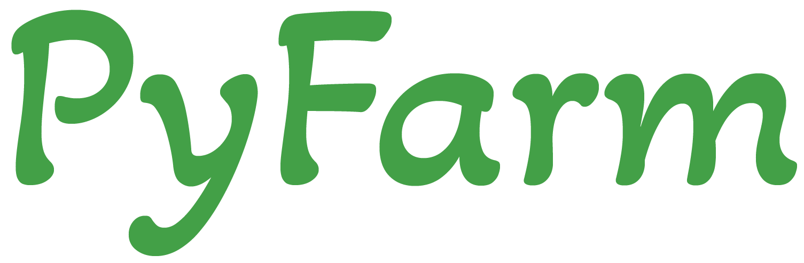

# Description

Pyfarm is an open source farm management system created and maintained by
Kevin Williams and KTech Industries. It's built primarily using Python and
various Raspberry Pis, but can also be run in a cloud environment.

For complete documentation, please view the online resources at
[URL Coming Soon!]()

## Directories

- [devices](): Contains various devices that can be used, either on their own,
  or in conjunction with the PyFarm API
- [docs](): Source files for documentation website, built with mkdocs
- [pyfarm_api](): The PyFarm api project, built with Python
- [pyfarm_app](): The PyFarm web app, built with React

# Features

# Getting Started

# Contributing
