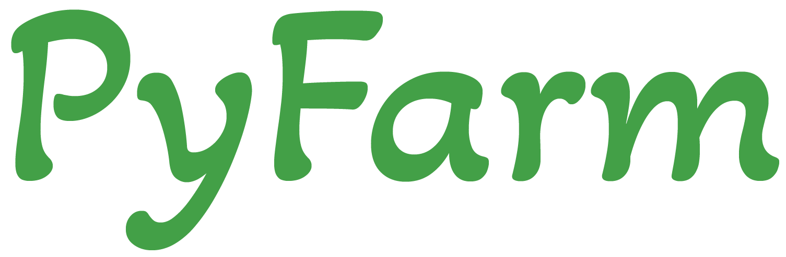

# PyFarm

## Introduction

Welcome to the PyFarm documentation! Pyfarm is an open source farm management
system created and maintained by
[Kevin Williams](https://github.com/KTech-Kevin) and
[KTech Industries](https://www.ktech.industries/).

PyFarm consists of multiple components including a web app, web api, and various
devices that can be used on their own, or in conjuction with the API.

Both the API and web app are designed in such a way that they can run on a
Raspberry Pi, but they will also work on a larger server or cloud environment.

## Features

- [x] Coming Soon!
- [ ] Not implemented

## Project Structure

The source code for PyFarm can be found on
[GitHub](https://github.com/KTech-Industries/PyFarm) and contains the following
projects.

### Devices

The devices directory contains a collection of various microcontroller devices
that can be used to help automate and collect information about your farm or
garden. Each device has a parts list, the source code, and additional
information about how to get started.

### Docs

The docs directory contains the source code for this documentation website.

### PyFarm API

The pyfarm_api directory contains all of the code relating to the PyFarm API,
and is written in Python. You will also find table definitions in this
directory.

### PyFarm App

The pyfarm_app directory contains all of the code for the web application, and
is written in Javascript / React.

## Contributors

[Kevin Williams](https://github.com/KTech-Kevin)
